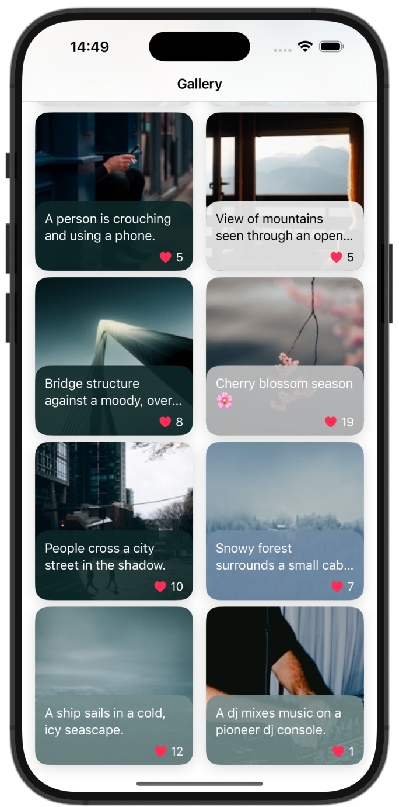

# Gallery

Gallery — это приложение для просмотра фотографий, использующее API Unsplash.

- Просмотр галереи фотографий.
- Детальный просмотр изображения.
- Поддержка различных ориентаций экрана.



## Требования

- iOS 18.0 или выше.
- Xcode 16.4 или выше.

## ❗️ API-ключ

Файл с API-ключом находится в `.gitignore`, поэтому перед запуском приложения необходимо создать файл `Gallery/Resources/Secrets.xcconfig` и указать в нем ваш API ключ Unsplash:

```plaintext
UNSPLASH_API_KEY=ваш_ключ
```

## Структура проекта

- `Gallery/Resources/` — ресурсы приложения, включая файлы конфигурации и локализации.
- `Gallery/Screens/` — экраны приложения, включая галерею и детальный просмотр.
- `Gallery/PhotoRepository/` — репозиторий для работы с API Unsplash.

# Архитектура MVVM

## Компоненты

1. Factory
   - Отвечают за создание экземпляров ViewModel, View и других компонентов.
   - Реализует Dependency Injection для ViewModel, чтобы в будущем ее можно было протестировать, заменяя любые компоненты моками.

2. ViewModel
   - Содержит всю бизнес-логику экрана.

3. View
   - Отвечает за пользовательский интерфейс и отправку взаимодействий в модель.
   - В рамках MVVM ViewController используется как View.
   - Внутри ViewController используется кастомный View (`customView`) для разделения логики, который также является частью View в модели MVVM.

4. Model
   - Содержит модель данных для View без бизнес-логики.
   - Содержит кложуры, которые вызывает View для отправки информации о нажатиях обратно в ViewModel.

5. Router
   - Управляет навигацией между экранами.

6. ModelFabric
   - Фабрика моделей для View, используется как вспомогательный элемент для ViewModel для маппинга сетевой модели в модель, пригодную для View.
